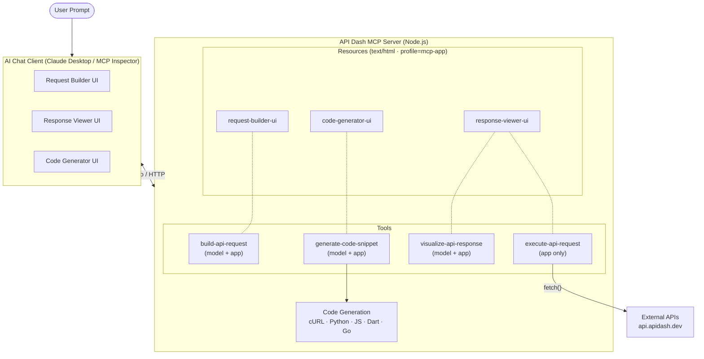
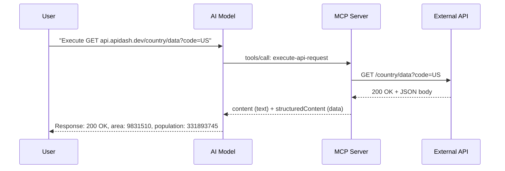

# API Dash MCP Apps Server

> **GSoC 2026 PoC** — CLI & MCP Support for [API Dash](https://github.com/foss42/apidash)

A TypeScript MCP server that exposes API Dash's core features as interactive **MCP Apps** — rich HTML UIs rendered inside AI chat clients.

## Architecture



### Data Flow



## How It Works

Each tool declares a `_meta.ui.resourceUri` pointing to an HTML resource. When the host calls the tool:

1. **Host preloads the UI resource** — fetches the HTML from the `ui://` resource URI
2. **AI model calls the tool** (e.g., `execute-api-request`) based on user prompt
3. **Server executes** the tool logic (e.g., HTTP request via `fetch()`) and returns `content` + `structuredContent`
4. **Host renders the UI** in a sandboxed iframe and pushes `structuredContent` via `postMessage` JSON-RPC
5. **User interacts** with the UI — the iframe can call server tools back through the host

Tool visibility controls who can call each tool:
- **`[model+app]`** — AI model can invoke it, and the iframe UI can also call it
- **`[app]`** --- Only the iframe UI calls it (hidden from the AI model)

## Setup

```bash
npm install
npm run build
```

## Running

**HTTP mode** (for MCP Inspector / testing):
```bash
npm run dev
# or: npm start (after build)
```

**Stdio mode** (for Claude Desktop):
Configured automatically — see Claude Desktop section below.

## Testing

**Health check:**
```bash
curl http://localhost:3000/health
```

**MCP Inspector** (visual tool/resource browser):
```bash
npm run dev                  # Terminal 1: start server
npm run inspector:http       # Terminal 2: open inspector
```

**Test all tools in Claude Desktop:**
```
Test all API Dash MCP tools one by one:

1. Use build-api-request with preset "GET Country Data"
2. Use execute-api-request with method GET, url https://api.apidash.dev/country/data, queryParams {"code": "US"}
3. Use execute-api-request with method POST, url https://api.apidash.dev/case/lower, headers {"Content-Type": "application/json"}, body "{\"text\": \"I LOVE Flutter\"}"
4. Use execute-api-request with method GET, url https://api.apidash.dev/humanize/social, queryParams {"num": "8700000", "digits": "3", "system": "SS"}
5. Use visualize-api-response with statusCode 200, statusText "OK", method "GET", url "https://api.apidash.dev/country/data?code=US", duration 150, headers {"content-type": "application/json"}, body {"data": {"area": 9831510, "population": 331893745}}
6. Use generate-code-snippet with method GET, url https://api.apidash.dev/humanize/social, queryParams {"num": "8700000", "digits": "3"}
7. Use generate-code-snippet with method POST, url https://api.apidash.dev/case/lower, headers {"Content-Type": "application/json"}, body "{\"text\": \"Hello World\"}"

Call each tool sequentially and show the results.
```

## Claude Desktop Configuration

Add to `~/Library/Application Support/Claude/claude_desktop_config.json`:

```json
{
  "mcpServers": {
    "apidash-mcp-apps": {
      "command": "node",
      "args": [
        "/absolute/path/to/2026/luxshan_thavarasa_cli_mcp_support/dist/stdio.js"
      ]
    }
  }
}
```

Then restart Claude Desktop.

## Code Generation

Server-side codegen produces idiomatic snippets in 5 languages, ported from API Dash's Dart codegen:

| Language | Library | Source Template |
|----------|---------|----------------|
| cURL | — | `lib/codegen/others/curl.dart` |
| Python | requests | `lib/codegen/python/requests.dart` |
| JavaScript | fetch | `lib/codegen/js/fetch.dart` |
| Dart | http | `lib/codegen/dart/http.dart` |
| Go | net/http | `lib/codegen/go/http.dart` |

## File Structure

```
src/
├── server.ts               Shared MCP server setup (resources + tools)
├── index.ts                HTTP transport (Express)
├── stdio.ts                Stdio transport (Claude Desktop)
├── styles.ts               Dark theme CSS + postMessage JSON-RPC bridge
├── ui/
│   ├── request-builder.ts  Request builder form
│   ├── response-viewer.ts  Response visualization
│   └── code-generator.ts   Tabbed code snippet viewer
├── utils/
│   └── codegen.ts          Multi-language code generation
└── data/
    └── sample-requests.ts  Preset requests from API Dash test suite
```

## Connection to GSoC Proposal

This PoC demonstrates the core concept from the CLI & MCP Support proposal:

- **API Dash features as MCP tools** — request building, execution, visualization, codegen
- **Interactive MCP Apps** --- rich HTML UIs in sandboxed iframes, not just text
- **Server-side HTTP execution** — avoids CORS, matches how the full Dart MCP server would work
- **Multi-language codegen** — faithful ports of API Dash's Dart codegen templates
- **Dual transport** — stdio for Claude Desktop, HTTP for MCP Inspector

The full GSoC implementation extends this to work with API Dash's Hive database, `apidash_core` models, and `better_networking` HTTP engine via a Dart MCP server.
